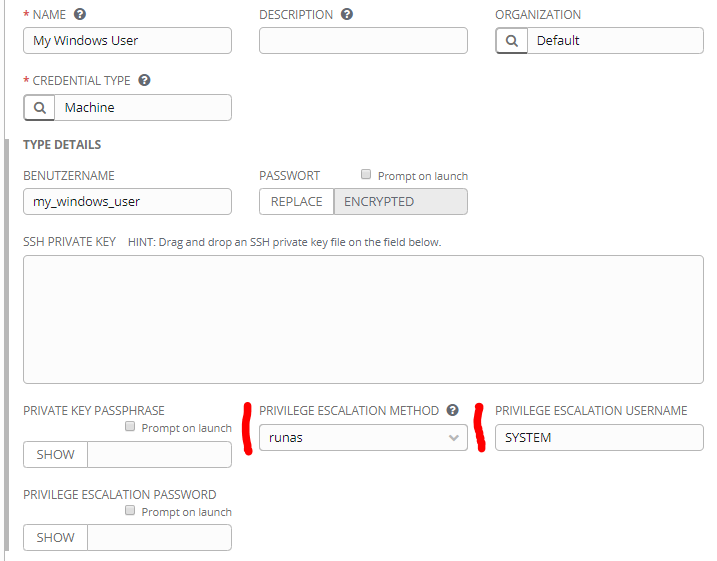

# Ansible Role "os_patching"

An Ansible role to deploy operating system patches the most convenient way for Windows and Linux systems.
##  
##  
  

____
## Operations

### download

Download packages or patches without installing them.

### 'install'

Install available packages or patches. The main use case of this role.

### 'deploy'

This operation downloads all patches or packages first and installs them afterwards.  
##  
  
  

____
## Variables

### pre_reboot

Default: false  
Type: Boolean  
Description: Will reboot the system before installation of patches if set to 'true'.

### auto_reboot

Default: false  
Type: Boolean  
Description: Will reboot the system if set to 'true'.

### max_reboots

Default: 5  
Type: Integer  
Description: Number of reboots that are allowed during installation of Windows Patches.  
##  
  
____
## Privilege Escalation

* **TAKE SPECIAL CARE** when using this role for Windows systems. 
The role uses the Windows Update Agent (WUA) and needs administrative privileges. 
It is recommended to escalate privileges with "ansible_become_method: runas" and "ansible_become_user: SYSTEM". 
Note: this was only tested in connection with Ansible Tower. YMMV. 
See image in folder 'docs' for Ansible Tower Credential example configuration.
For further information about using SYSTEM, check [this](https://stackoverflow.com/questions/54712026/privilege-elevation-in-windows-with-ansible) and
[this](https://groups.google.com/forum/#!msg/ansible-project/bGJlNtktKRA/VVNIOykoDAAJ)
* linux package manager usually need a privilege escalation as well.  
  

##  

____
## Requirements

 * Ability to connect to target host (obviously)
 * Ansible version restrictions not tested. Tested with Ansible 2.7 and Ansible Tower 3.4.  
##  
____
## Dependencies

None. 
##   
____
## Known issues
 
 * Windows Updates take a very, very, very, very long time.  
##  
____
## ToDo
 
 * There are known cases where WUA needs a reset. This playbook could take care of WUA reset as well but currently does not.  
##  
____
## Developer notes

 * All reboots are non-default. This should ensure that running that role without explicit options has as little impact as possible. For enabling reboots the corresponding variables must be set.
 * The reboot behaviour is not consistent in this role! Linux systems are rebooted exactly once when role 'operation == install' and 'auto_reboot == true'. Windows systems with the same options are only rebooted if a check determined that a reboot is required. The reason for taking reboot check into account is that windows installation (install-win.yml) runs multiple times and and time is already a sensible factor with windows, so we don't want to lengthen run time by unnecessary reboots. Linux update installation (install-linux.yml) is only executed once and therefore a reboot check is not as important to save time as for windows systems. To ensure that a windows system is rebooted during this role although not required, the parameter pre_reboot can be used. 
 * During testing, it occurred that the RebootRequired value got lost when interrupting the play and executing it again.
 * Checking pending reboots is a very complex topic. Have a look at [this](https://devblogs.microsoft.com/scripting/determine-pending-reboot-statuspowershell-style-part-1/), 
 [this](https://devblogs.microsoft.com/scripting/determine-pending-reboot-statuspowershell-style-part-2/) and [this](https://adamtheautomator.com/pending-reboot-registry-windows/)
 * Testing patching is no fun at all. It is almost impossible to reproduce behavioural oddities of Windows Update. 
 * This role was written with Windows Update Agent (WUA). Being well aware of the fact that there is an ansible module "win_updates" for this purpose.
 * Currently this role installs a powershell module assuming that the target environment has no local PSRepository and no access to internet repositories.
##  
____
## Support

This Ansible role is written and maintained mostly by phoffmann@spirit21.com.